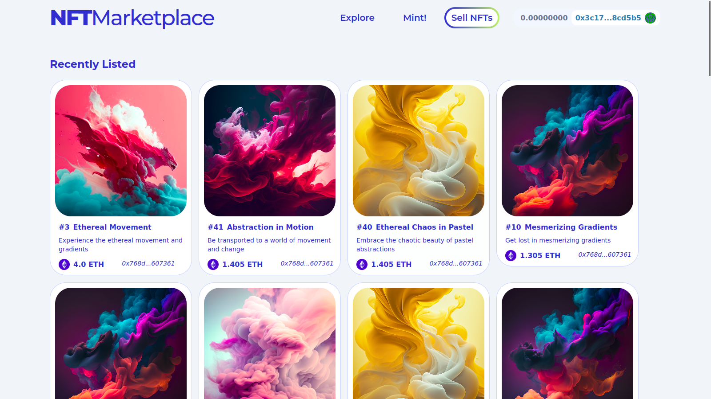

<a name="readme-top"></a>
[](https://github.com/julienbrs)
[![LinkedIn][linkedin-shield]][linkedin-url]

<!-- PROJECT LOGO -->
<br />
<div align="center">
  <a href="https://frontend-marketplace-nfts.vercel.app/">
    
  </a>
  </a>
  <h3 align="center">
    <a href="https://frontend-marketplace-nfts.vercel.app/">Dapp Marketplace</a>
  </h3>
  </p>
</div>
<!-- TABLE OF CONTENTS -->
<summary>Table of Contents</summary>
<ol>
<li>
    <a href="#about-the-project">About The Project</a>
</li>
<li>
    <a href="#getting-started">Getting Started</a>
    <ul>
    <li><a href="#prerequisites">Prerequisites</a></li>
    <li><a href="#installation">Installation</a></li>
    <li><a href="#usage">Usage</a></li>
    </ul>
</li>
<li><a href="#contact">Contact</a></li>
</ol>
<br />
<!-- ABOUT THE PROJECT -->

## About The Project


A decentralized application (dapp) marketplace built on the Goerli testnet using the Ethereum blockchain. The marketplace allows users to list, buy and sell Non-Fungible Tokens (NFTs). The marketplace also includes a feature to mint a new NFT from the "Ethereal" collection for 0.01ETH, to test the marketplace functionality.

Test the dApp here: [NFT Marketplace](https://frontend-marketplace-nfts.vercel.app/)
Check the frontend repo here: [Frontend repositorie](https://github.com/julienbrs/frontend-marketplace-nfts)
<br />
<p align="center">
  
</p>
<p align="right">(<a href="#readme-top">back to top</a>)</p>

<!-- GETTING STARTED -->
## Getting Started

To get a local copy up and running follow these simple example steps.
### Prerequisites

    A web3 browser (e.g. MetaMask)
    An Ethereum wallet with some Goerli testnet Ether
    Hardhat framework to test and deploy

### Installation

Clone the repo

```sh
git clone https://github.com/julienbrs/nft-marketplace.git
```

Install package dependencies using yarn
```sh
yarn
```


<p align="right">(<a href="#readme-top">back to top</a>)</p>

## Usage

The dapp marketplace allows users to list NFTs for sale, view and purchase available NFTs, and mint a new NFT from the "Ethereal" collection for 0.01ETH. Users must have a web3 browser and an Ethereum wallet with Goerli testnet Ether to interact with the marketplace.
Usage

<p align="right">(<a href="#readme-top">back to top</a>)</p>

## Features

List NFTs for sale
Browse and purchase available NFTs
Mint new NFTs from the "Ethereal" collection for 0.01ETH

</br>

Please note that this marketplace is built on the Goerli testnet and any transactions made will not result in real ether being transferred, and it's only for testing purposes.


<!-- CONTACT -->

## Contact

Bourseau Julien - _2nd year student at Ensimag, 2022_ - julien.bourseau@gmail.com

Project Link: [https://github.com/julienbrs/nft-marketplace](https://github.com/julienbrs/nft-marketplace)

<p align="right">(<a href="#readme-top">back to top</a>)</p>

[linkedin-shield]: https://img.shields.io/badge/-LinkedIn-black.svg?style=for-the-badge&logo=linkedin&colorB=555
[linkedin-url]: https://www.linkedin.com/in/julien-bourseau-ba2239228